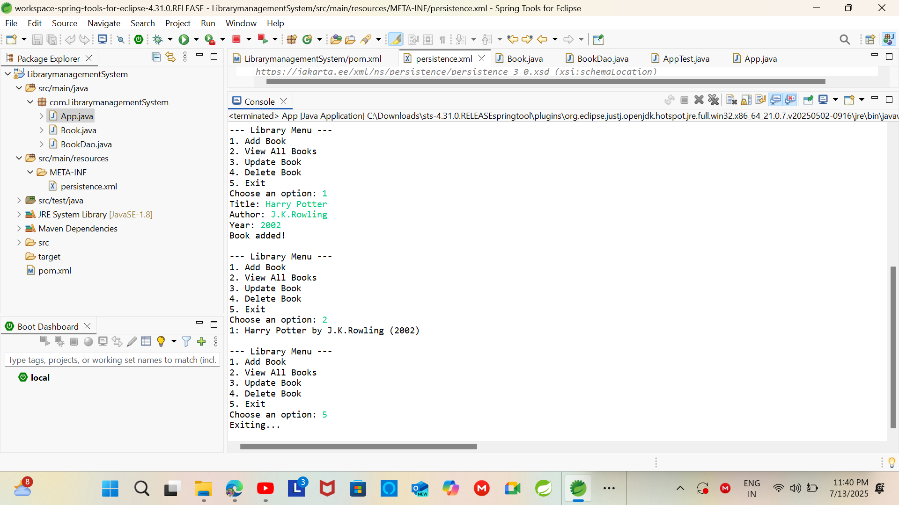

# 📚 Menu-Driven Java Console Library Management System Project using Maven, JPA, and Hibernate

A simple and user-friendly Library Management System to help manage books, members, and transactions efficiently.

This project demonstrates how to build a menu-driven Java console application for library management using Maven for build automation, JPA (Java Persistence API) for ORM, and Hibernate as the JPA implementation. The application allows users to perform CRUD operations (Create, Read, Update, Delete) on books and members, and to manage book issues and returns, all through a simple console menu.

### Key Steps:
1. **Set up a Maven Project:**
   - Use `mvn archetype:generate` or your IDE to create a Maven project.
    - Add dependencies for JPA, Hibernate, and your database (e.g., H2 for testing, PostgreSQL for production) in `pom.xml`.
2. **Configure JPA and Hibernate:**
   - Create a `persistence.xml` in `src/main/resources/META-INF`.
   - Set up entity classes for `Book`, `Member`, and `Transaction`.
   - Configure Hibernate dialect and connection properties.
3. **Implement the Console Menu:**
   - Use Java’s `Scanner` for user input.
   - Display menu options (Add Book, View Books, Issue Book, etc.).
   - Handle user choices with appropriate JPA operations.
4. **Run and Test:**
   - Build the project with `mvn clean install`.
   - Run the main class and interact with the menu in the console.

This approach ensures a clean, maintainable, and extensible architecture for your Java console application.

## ✨ Features
- ➕ Add, update, and delete books
- 👥 Manage member registrations
- 📖 Issue and return books
- 📅 Track issued/returned books and due dates
- 🖥️ Simple and intuitive interface

## 🛠️ Technologies Used
- JPA (Spring Framework)
- Spring Boot
- PostgreSQL (production or main database)

## 🚀 How to Run the Project
1. Clone or download this repository.
2. Open the project in Spring Tool Suite (STS) or your preferred IDE.
3. Build the project using Maven or Gradle.
4. Run the application (`LibrarymanagementSystemApplication.java`).
5. Open your browser and go to `http://localhost:8080`.

## 🖼️ Screenshot
Below is a sample screenshot of the application interface:

---

🙏 **Thank you for checking out this project! If you have any questions or suggestions, feel free to reach out. Happy coding!**

